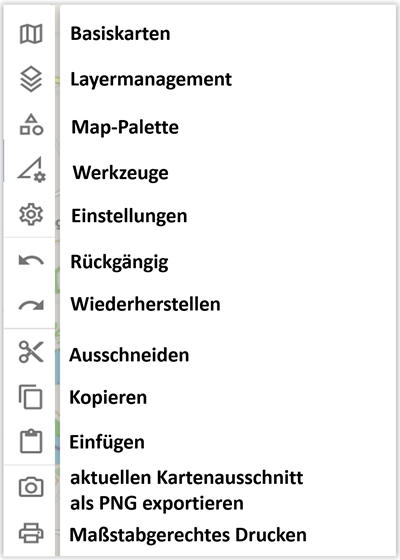
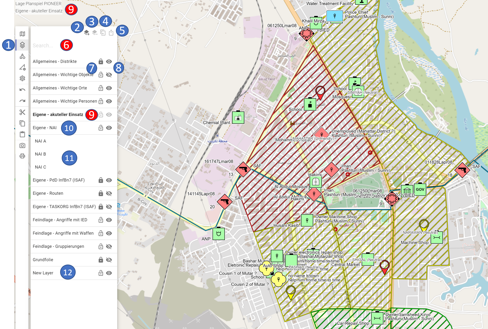
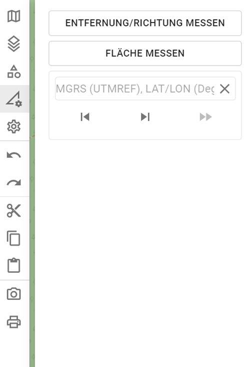
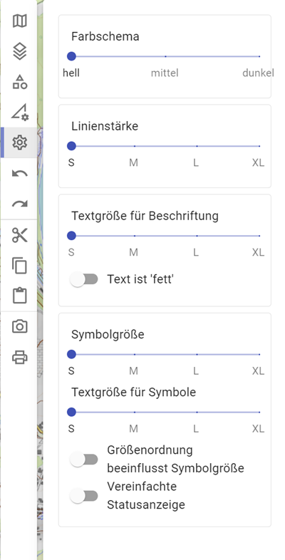
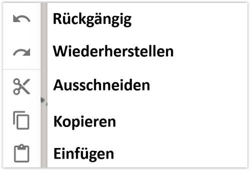

# Activity Bar

Die Activity Bar ist in folgende Bereiche gegliedert:

## Basiskarten

Im Bereich der Basiskarten werden Euch all jene Karten angezeigt, welche ihr im Rahmen der Kartenverwaltung selbst angelegt habt. Ausnahme ist die Open Street Map, da diese die „Systemkarte“ von ODIN ist:

- 1 Bereich der Basiskarten

- 2 Reihenfolge der Karten (Änderung mittels Drag & Drop möglich)

- 3 Open Street Map = Standardkarte von ODIN

- 4 aktive Karten (= in schwarzer Schrift, Auge-Symbol ist „offen“)

- 5 Deckkraft der jeweiligen Karte (0% - 100%)

- 6 ausgeblendete Karte (= in grauer Schrift, Auge-Symbol ist „geschlossen“)

- 7 aktive Karte inkl. Anzeige im rechten unteren Kartenbereich

Die **Reihenfolge** der **Karten** hat Auswirkungen auf deren Anzeige. Hier wird das Prinzip „Ober sticht Unter“ angewendet, d.h. die obere Karte „überdeckt“ den Inhalt der unteren Karten.

Die **Open Street Map** ist die Standardkarte von ODIN und kann nur ausgeblendet, nicht aber (im Bereich der Kartenverwaltung) gelöscht werden.

**Aktive Karten** können auch solche sein, die selbst keine Karten enthalten, sondern zusätzliche Karteninformationen (z.B. Straßen, Gewässer, Bahnhöfe, Feuerwehren, Bewuchs, Kulturgüter etc.) zur Verfügung stellen.

Mit Anpassung der **Deckkraft** habt Ihr die Möglichkeit mehrere Karten übereinander in ODIN darzustellen (z.B. Open Street Map und Basemap.at/Orthofoto), um so die Karte aufzubereiten, wie Ihr es benötigt.

Im rechten unteren Bereich der Karte könnt ihr die von Euch **genutzten Karten anzeigen** lassen. Die Erstellung dieser Anzeige erfolgt über die Kartenverwaltung (Schritt 4 – Namensnennungen). Dort habt ihr die Möglichkeit die „Quelle“ inkl. Nutzungsbedingungen anzugeben, um hier rechtlich auf der sicheren Seite zu sein. Die entsprechenden Einträge findet Ihr im Annex A (Übersicht - Kostenlose Onlinekarten) und könnt diese mittels Kopierens & Einfügen somit leicht sicherstellen.

## Layermanagement

Im Bereich des Layermanagements werden alle von Euch erstellten oder importieren (GeoJson)Layer angezeigt:

- 1 Bereich des Layermanagements

- 2 Layer erstellen

- 3 Layer löschen

- 4 Layer duplizieren

- 5 Layer teilen

- 6 Suche im Layermanagement *(dzt. noch nicht umgesetzt)*

- 7 Layer sperren/entsperren („Schloss“-Symbol)

- 8 Layer ein-/ausblenden („Auge“-Symbol)

- 9 aktiver Layer

- 10 nicht aktiver Layer

- 11 Inhalt des Layers („Layerbaum“)

- 12 Anzeige neuer Layer (wenn über Button „Layer erstellen“ erfolgt)

Mit **Layer erstellen** könnt Ihr einen neuen Layer erstellen. Dieser wird als „New Layer“ im Layermanagement angezeigt. Zum Umbenennen des Layers drückt ihr beim „New Layer“ die `ENTER-Taste`, gebt den gewünschten neuen Layernamen ein und bestätigt wieder mit der `ENTER-Taste`.

Mit **Layer löschen** könnt ihr einen markierten Layer *(Mehrfachselektion ist noch nicht möglich)* löschen. Dies ist auch durch Drücken der `ENTF-Taste` möglich.

Bei **Layer duplizieren** wird ein neuer Layer mit allen im bisherigen Layer enthaltenen Objekten erstellt. Duplizierte Layer werden mit dem gleichen Namen und einer fortlaufenden Zahl (beginnend mit (1), (2) …) erstellt.

Alle diese Funktionen sind in der „Rückgängig“- bzw. „Wiederherstellen“-Funktionalität mit eingebunden.

Bei **Layer teilen** könnt Ihr einen einzelnen Layer exportieren, um diesen auf Euren Rechner lokal abzuspeichern und anschließend per USB-Stick, Email etc. anderen Nutzern zur Verfügung zu stellen.

*Der Bereich **Suche** im Layermanagement ist noch nicht umgesetzt.*

Mit dem **„Schloss“-Symbol** habt Ihr die Möglichkeit **Layer** zu **sperren** bzw. zu **entsperren**. Ist ein Layer gesperrt, können die darin enthaltenen Objekte auf der Karte nicht verändert (z.B. verschoben, Linien/Räume ändern etc.) bzw. aus dem Layer (entweder im „Layerbaum“ oder auf der Karte) gelöscht werden. Die Bearbeitung der einzelnen Objekte (z.B. Änderungen im Eigenschaftsfenster, Umbenennen etc.) ist jedoch weiterhin möglich.

Mit dem **„Auge“-Symbol** habt Ihr die Möglichkeit **Layer** **ein-** bzw. **auszublenden**. Damit könnt Ihr das Lagebild auf „Layerbasis“ Euren Bedürfnissen anpassen.  *Ein Ausblenden einzelner Objekte ist dzt. noch nicht umgesetzt.*

Der **aktive Layer** (= schwarze Schrift) ist jener Layer, in welchen alle neu erstellten Objekte (aus der Map-Palette) oder kopierten Objekte (aus der Zwischenablage) eingefügt werden. Um einen Layer als aktiven Layer festzulegen, müsst Ihr diesen nur mit einem **Doppelklick** **aktivieren**. Der aktive Layer kann daher weder gelöscht, ausgeblendet noch gesperrt werden.

Die **nicht aktiven Layer** (= graue Schrift) sind alle anderen Layer im Layermanagement (= es gibt immer nur einen aktiven Layer). Beim nicht aktiven Layer ist bis auf das Hinzufügen von Objekten jede andere Bearbeitung (z.B. Objekte löschen, sperren, ausblenden, teilen etc.) möglich.

Enthält ein Layer keine Objekte sind das "Schloss"- und das "Auge"-Symbol ebenfalls nicht auswählbar.

Beim Anklicken des Layernamens mit der Maus, öffnet sich der **„Layerbaum“** und der Inhalt des Layers wird in alphabetischer Reihenfolge angezeigt. Im Layerbaum können die Objekte gelöscht werden. Wird im Layerbaum ein Objekt ausgewählt, öffnet sich das Eigenschaftsfenster und das Objekt wird markiert auf der Karte angezeigt (sofern es sich dzt. im aktuellen Kartenausschnitt befindet, *ein „Hinspringen“ auf die Karte ist dzt. noch nicht umgesetzt*). Die anderen Objekte auf der Karte werden dagegen „blasser“ dargestellt.

Die **Anzeige** der **Namen** der **Objekte** im „Layerbaum“ erfolgt aufgrund Eurer Eingabe im Feld **„Name“** des Eigenschaftsfensters. Ist dieses Feld leer, wird im „Layerbaum“ die Eingabe aus dem Feld **„Unique Designation“** angezeigt. Sind beide diese Felder leer, erfolgt die Anzeige mit **„N/A“** (not available) im „Layerbaum.

## Map-Palette

Im Bereich der Map-Palette könnt Ihr die Symbole gemäß MILSTD-2525C auswählen, um diese auf der Karte darzustellen bzw. einzuzeichnen:

|  |  |  |
| ----------------------------- | ----------------------------- | ----------------------------- |

- 1 Bereich der Map-Palette

- 2 Festlegung des „Hostility Status“

- 3 Festlegung ob Objekte gemeldet oder geplant dargestellt werden

- 4 Suche in der Map-Palette

- 5 auswählbares Objekt (mit Vorschau auf taktisches Zeichen)

- 6 ziviles Objekt (Darstellung bereits gem. MIL-STD 2525D)

- 7 dzt. nicht unterstütztes und somit darstellbares Objekt

Im oberen linken Bereich könnt ihr festlegen, mit welchen**„Hostility“-Status** die Objekte bereits beim Erstellen auf der Karte dargestellt werden sollen (die Einstellung gilt solange für alle Objekte, bis ihr einen anderen „Hostlity“-Status festlegt). Hier stehen die vier Grundtypen „Friend (Eigene)“, „Hostile (Feind)“, „Neutral (Neutral)“ und „Unknown (Unbekannt)“ zur Auswahl zur Verfügung.

Daneben könnt Ihr noch festlegen, ob die **Objekte gemeldet** (= durchgezogen) oder **geplant** (= strichliert) bei der Erstellung auf der Karte dargestellt werden sollen.

Im Bereich der **Suche** könnt ihr nach allen Symbolen (außer METOC) gem. MIL-STD2525C suchen. Die Suche (ganze Wörter) bezieht sich sowohl auf den Symbolnamen, als auch auf den Hierachiepfad. Gebt Ihr mehrere Wörter ein, werden jene Symbole ganz oben gereiht, auf welche mehrere Treffer entfallen.

Bei der Suche können folgende Wildcards (damit nicht nach ganzen Wörtern gesucht werden muss) verwendet werden:

-   **\*** „=“ für einen Teil des Begriffes z.B. infan\* mech\* = infantry + mechanized
    
-   **+** „=“ schließt dieses Wort ein z.B. infan\* +mech\* = mechanized muss enthalten sein
    
-   **-** „=“ schließt dieses Wort aus z.B. infan\* -mech\* = mechanized wird nicht angezeigt

Bei den Symbolen ist vor dem Symbolnamen und dem Hierachiepfad eine **Symbolvorschau** abgebildet.

Jene **taktischen Grafiksymbole** gem. MIL-STD 2525C, die wir noch **nicht umgesetzt** haben, werden in **roter Schrift** und mit **„unsupported“** gekennzeichnet aufgelistet. Bei diesen Symbolen erfolgt keine Auswahlmöglichkeit mittels der Maus.

## Werkzeuge

Im Bereich der Werkzeuge sind die GIS-Funktionalitäten von ODIN verfügbar:

- 1 Bereich der Werkzeuge

- 2 verfügbare GIS-Funktionalitäten

Zu beachten ist, dass die **GIS-Funktionalitäten** in ODIN **nicht gespeichert** werden. Dies bedeutet, dass diese nach einem **Neustart von ODIN nicht mehr verfügbar** sind. Weiters sind die GIS-Funktionalitäten nicht in die „Rückgängig/Wiederherstellen“-Logik mit eingebunden.

### Entfernung/Richtung messen

- 1 grüner Punkt = Startpunkt der Streckenberechnung

- 2 Distanzangabe in m/km für die Teilstrecke

- 3 Winkelangabe für die Teilstrecke in Grad

- 4 roter Punkt = Endpunkt der Streckenberechnung

- 5 Gesamtlänge der Strecke in m/km

Mit **Entfernung/Richtung messen** könnt Ihr auf der Karte die Länge einer Strecke messen. Zusätzlich zur Gesamtlänge werden für die Teilstrecken (= die Linie zwischen zwei gesetzten Punkten) auch die Länge und der Winkel dazu angegeben.

Ihr könnt dabei jederzeit die Strecke wie folgt verändern (die Änderung werden sofort mitberücksichtigt):

-   Mit der Maus auf die Linie klicken und mit dem Mauszeiger verschieben.
-   Punkte löschen, in dem Ihr die `ALT-Taste` gedrückt hält und mit der **Maus** auf die **gesetzten Punkte** der Linie **klickt**.

### Fläche messen

- 1 Distanzangabe in m/km für die Teilstrecke

- 2 Gesamtfläche in m²/km²

- 3 Umfang der Fläche in m/km

Mit **Fläche messen** könnt Ihr auf der Karte die Fläche eines Bereiches messen. Zusätzlich zur Gesamtlänge, erfolgt auch hier die Angabe der Länge zu den einzelnen Teilstrecken. In der Mitte der Fläche werden die Gesamtfläche in m²/km² (oben) und der Umfang der Fläche (darunter) angezeigt.

Das Verändern der Fläche erfolgt analog wie bei Entfernung/Richtung messen.

## Einstellungen

Im Bereich der Einstellungen sind folgende Funktionalitäten verfügbar:

Aufgrund des Umfanges erfolgt die **Detailbeschreibung** zu den einzelnen Funktionalitäten im **Kapitel "Einstellungen"** gesondert!

## „Windows“-Funktionalitäten

Hier stehen euch folgende typischen „Windows“-Funktionalitäten zur Verfügung:

Mit **Rückgängig** (`STRG` + `Z`) und **Wiederherstellen** (`STRG` + `SHIFT` + `Z`) könnt Ihr Eure letzten 32 Bearbeitungsschritte mit einem Klick bzw. Shortcut entsprechend aufheben bzw. wiederherstellen. **Nicht** in die **„Rückgängig/Wiederherstellen“-Logik** sind die **GIS-Funktionaltäten**, sowie die **Änderungen** in den **Objekteigenschaften** mit eingebunden.

Die Funktionen **Ausschneiden** (`STRG` + `X`), **Kopieren** (`STRG` + `C`) und **Einfügen** (`STRG` + `V`) sind eigentlich selbsterklärend.

Ergänzend ist hinzufügen, dass Ihr durch Halten der `STRG-Taste` und **„Aufziehen“** eines **Bereiches** mit der **Maus** alle darin auf der Karte befindlichen Objekte (auch wenn z.B. nur Teile einer Linie/Raumes betroffen sind) markieren und so mehrere auf einmal Kopieren und Einfügen könnt. Zu beachten ist hier, dass alle Objekte, die mittels Einfügens bearbeitet werden, **immer** den **aktiven Layer hinzugefügt** werden.

## Aktuellen Kartenausschnitt als PNG exportieren

Diese Funktion ermöglicht es Euch, die aktuelle Kartenansicht als PNG-Bilddatei zu exportieren, um diese z.B. in einem anderen Programm (PowerPoint, Word etc.), auf einer Homepage etc. zu verwenden.

Nach Drücken des Buttons **„Aktuellen Kartenausschnitt als PNG exportieren“** öffnet sich der Explorer und Ihr könnt den aktuell auf dem Bildschirm sichtbaren Kartenbereich inkl. der Lage als PNG-Bilddatei exportieren. Dabei werden jedoch **geöffnete Bereiche** (z.B. Activity Bar, Eigenschaftsfenster), sowie die **zusätzlichen Kartenangaben** (z.B. Datumsanzeige, Koordinatenanzeige, Maßstab etc.) **nicht „mit exportiert“**.

## Maßstabgerechtes Drucken

Im Bereich des maßstabgerechten Drucken sind folgende Funktionalitäten verfügbar:

Aufgrund des Umfanges erfolgt die **Detailbeschreibung** zu den einzelnen Funktionalitäten im **Kapitel "Maßstabgerechtes Drucken"** gesondert!

