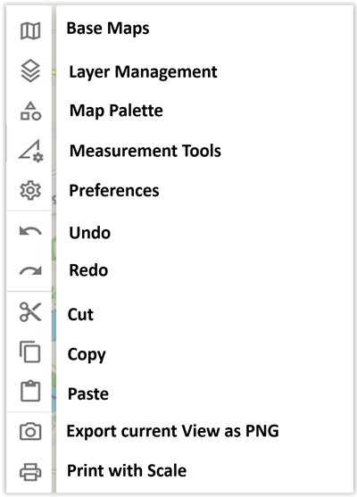
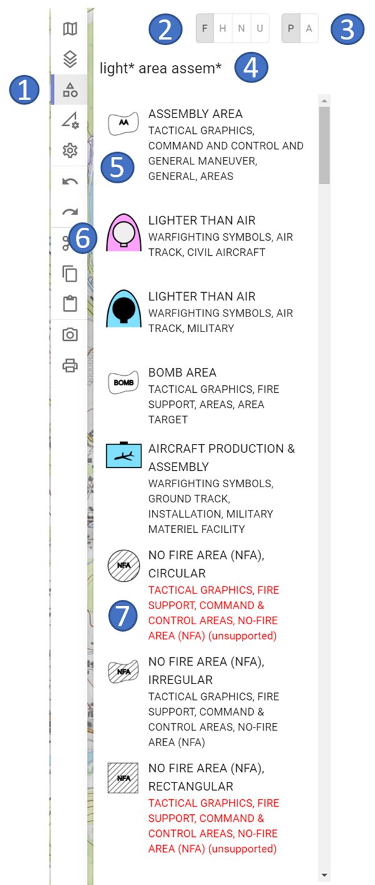
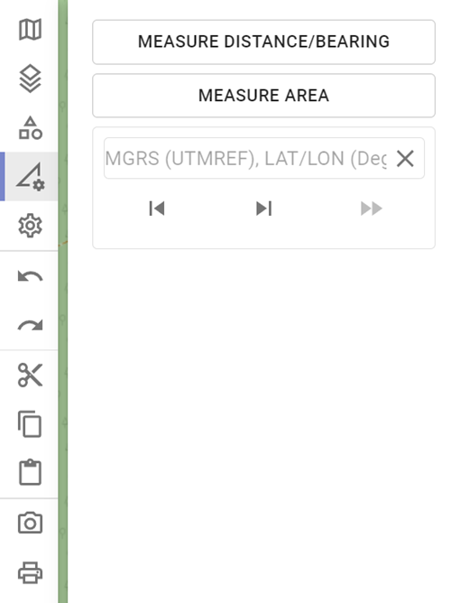
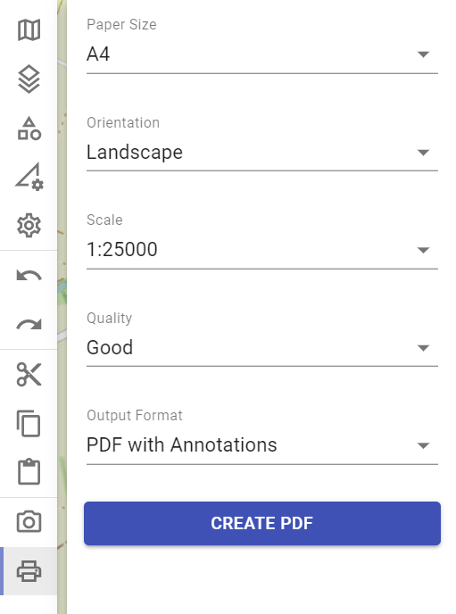

# Activity Bar

The Activity Bar is divided into the following sections:

## Base Maps

In the area of the base maps all those maps are shown to you, which you have created in the context of the map administration. Exception is the Open Street Map, because this is the "system map" of ODIN:

- 1 integrated base maps
- 2 order of the maps (change possible by drag & drop)
- 3 Open Street Map = default map from ODIN
- 4 active maps (= in bold font, eye symbol is "open")
- 5 opacity of the respective map (0% - 100%)
- 6 hidden maps (= in gray font, eye symbol is "closed")
- 7 active map incl. display in the lower right map area

The **order** of the **maps** has an effect on their display. Draw order is from maps at the bottom of the list to the top. I.e. map content might be covered from maps ordered above.

The **Open Street Map** is the default map of ODIN and can only be hidden, but not deleted (in the map management area).

**Active Maps** might not contain base maps, but provide additional map information (e.g. roads, water bodies, train stations, fire stations, vegetation, cultural assets, etc.).

By adjusting the **opacity** you have the possibility to display several maps on top of each other in ODIN (e.g. Open Street Map and Basemap.at/Orthofoto) to prepare the map the way you need it.

In the lower right area of the map you can display the maps you **used**. The creation of this display is done via the map administration (step 4 - naming). There you have the possibility to indicate the "source" incl. terms of use, in order to be here legally on the safe side. You will find the corresponding entries in Annex A (Overview - Free Online Maps) and can thus easily ensure these by means of copy & paste.

## Layer Management

In the layer management area, all the layers you have created or imported (GeoJson) are displayed:

- 1 layer management area
- 2 create layer
- 3 delete layer
- 4 duplicate layer
- 5 share layer
- 6 search in layer management *(not yet implemented)*
- 7 lock/unlock layer ("lock" symbol)
- 8 show/hide layer ("eye"-symbol)
- 9 active layer
- 10 not active layer
- 11 content of the layer ("layer tree")
- 12 display of new layer (if done via button "Create layer")

With **Create Layer** you can create a new layer. This will be displayed as "New Layer" in the layer management. To rename the layer press the `ENTER` key at the "New Layer", enter the layer name and confirm with the `ENTER` key again.

With **Delete Layer** you can delete a selected layer *(multiple selection is not possible yet)*. This is also possible by pressing the `DEL` key.

With **Duplicate Layer** a new layer will be created with all objects contained in the previous layer. Duplicated layers are created with the same name and a consecutive number (starting with (1), (2) ...).

All these functions are included in the "Undo" or "Redo" functionality.

With **Share Layer** you can export a single layer to save it locally on your computer and then make it available to other users via USB stick, email, etc.

The **Search** section in the layer management is not yet implemented.

With the **"lock"-symbol** you have the possibility to **lock** or **unlock** layers. If a layer is locked, the objects it contains cannot be changed on the map (e.g. moved, lines/spaces changed etc.) or deleted from the layer (either in the "Layer Tree" or on the map). However, editing of the individual objects (e.g. changes in the properties window, renaming etc.) is still possible.

With the **"eye"-symbol** you have the possibility to **show** or **hide** **layers**. This allows you to adapt the situation picture to your needs on a "layer basis". *Hiding individual objects is not yet implemented.

The **active layer** (= bold font) is the layer where all newly created objects (from the map palette) or copied objects (from the clipboard) are inserted. To set a layer as active layer, you only have to **activate** it with a **double click**. The active layer can therefore neither be deleted, hidden nor locked.

The **non-active layers** are all other layers in the layer management (= there is always only one active layer). With the inactive layer every other editing (e.g. delete, lock, hide, share objects etc.) is possible except adding objects.

If a layer does not contain any objects, the "lock" and "eye" symbols are also not selectable.

When clicking the layer name with the mouse, the **"Layer tree"** will open and the contents of the layer will be displayed in alphabetical order. In the layer tree the objects can be deleted. If an object is selected in the layer tree, the properties window opens and the object is highlighted on the map (if it is currently in the current map section, *"Jumping" to the map is not yet implemented*). The other objects on the map are displayed more transparent.

The **display** of the **names** of the **objects** in the "Layer tree" is based on your input in the **"Name"** field of the properties window. If this field is empty, the input from the **"Unique Designation"** field is displayed in the "Layer Tree". If both these fields are empty, the display is **"N/A"** (not available) in the "Layer tree.

## Map Palette

In the Map Palette area you can select the symbols according to MILSTD-2525C to display or draw them on the map. **Note that for now METOC symbolics are not supported at all.**

|  |  |  |
| ----------------------------- | ----------------------------- | ----------------------------- |

- 1 map palette area
- 2 definition of the "Hostility Status"
- 3 definition of whether objects are displayed reported or planned
- 4 search in the map palette
- 5 selectable object (with preview of tactical character)
- 6 civilian object (representation already according to MIL-STD 2525D)
- 7 currently not supported and therefore not displayable object

In the upper left area you can define with which**"Hostility"-Status** the objects should be displayed on the map already during creation (the setting is valid for all objects until you define another "Hostility"-Status). Here you can choose between the four basic types "Friend", "Hostile", "Neutral" and "Unknown". Other values can be selected in **properties window** for a given object.

In addition, you can specify whether the **object's reported/present** (= solid) or **planned/anticipated** (= dashed) should be displayed on the map when they are created.

In the **Search** area you can search for all symbols according to MIL-STD 2525C. The search (whole words) refers to the symbol name as well as to the hierarchy path. If you enter more than one word, the symbols with more than one hit will be ranked on top.

The following wildcards can be used in the search:

- **\*** "=" for a part of the term e.g. infan\* mech\* = infantry + mechanized.

- **+** "=" includes this word e.g. infan\* +mech\* = mechanized must be included

- **-** "=" excludes this word e.g. infan\* -mech\* = mechanized is not displayed

Symbols have a **symbol preview** before the symbol name and hierarchy path.

Those **tactical graphic symbols** according to MIL-STD 2525C, which we have **not yet implemented**, are listed in **red font** and marked **"unsupported"**. There is no selection option with the mouse for these symbols.

## Measurement Tools

In the measurement tools section the GIS functionalities of ODIN are available:

Due to the scope of the individual functionalities, the **detail description** is made separately in the **chapter "Measurement Tools"**!

## Preferences

The following functionalities are available in the preferences area:

Due to the scope of the individual functionalities, the **detail description** is made separately in the **chapter "Preferences"**!

## Clipboard

The following clipboard functions are available here:

With **Undo** (`STRG` + `Z`) and **Redo** (`STRG` + `SHIFT` + `Z`) you can undo or redo your last 32 editing steps with one click or shortcut. **Not** included in the **"Undo/Redo"-logic** are the **GIS-functions**, as well as the **changes** in the **object properties**.

The functions **Cut** (`STRG` + `X`), **Copy** (`STRG` + `C`) and **Paste** (`STRG` + `V`) should be self-explanatory.

Additionally you can select all objects on the map (even if only parts of a line/space are affected) by holding the `STRG` key and **"dragging"** a **area** with the **mouse** and thus copy and paste several objects at once. Note here that all objects edited via paste will **always** be added to the **active layers**.

## Export current View as PNG

This function allows you to export the current map view as a PNG image file to use it e.g. in another program (Power Point, Word etc.), on a homepage etc.

After pressing the button **"Export current View as PNG"** the explorer opens and you can export the map area currently visible on the screen including the location as a PNG image file. However, **open areas** (e.g. Activity Bar, Properties window), as well as the **additional map information** (e.g. date display, coordinates display, scale etc.) **are not "exported"**.

## Print to Scale

The following functionalities are available in the print ot scale area:

Due to the scope of the individual functionalities, **detail description** is made separately in **chapter "Print to Scale"**!

